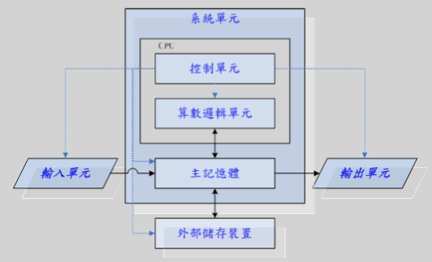

# 计算机概论

###计算机的组成部分

从外观说，可以分为以下三个部分：
* 输入单元：包括键盘、鼠标等
* 主机部分：包括CPU、主储存器等
* 输出单元：屏幕、打印机等

首先我们会通过键盘、鼠标等将一些数据输入到主机，然后由主机对输入数据进行处理，并将处理后的数据显示到屏幕或打印机上。整个主机的重点在于处理数据的CPU和储存输入数据的主存储器。CPU又分为主要负责协调各周边组件与各单元间工作的控制单元和主要负责程序运算与逻辑判断的算数运算单元。因此计算机可以说是由输入单元、控制单元、逻辑运算单元、主存储器、输出单元五大部分组成。

###CPU的种类

CPU可以分为精简指令集（RISC）和复杂指令集（CISC）。
