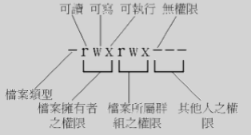
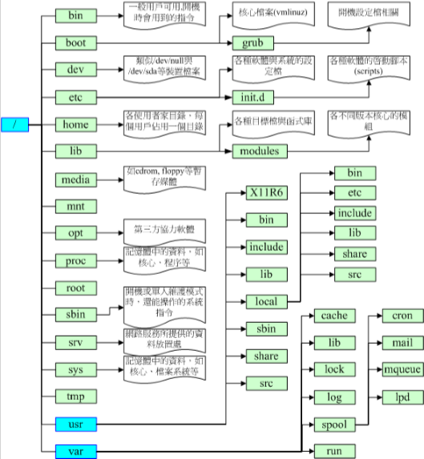

# Linux的档案权限与目录管理

###使用者与群组

* 档案拥有者
* 群组
* 其他人

###Linux文件属性


####第一栏

代表这个档案的类型与权限



```
第一个字符代表这个档案的类型：
  d：目录
  -：档案
  |：链接档（link file）
  b：可随机存取装置
  c：一次性读取装置
  s：资料接口文件（socket）
  p：数据输送文件（FIFO，pipe）
  
后每3个为一组
  第一组：档案拥有者权限
  第二组：群组权限
  第三组：其他人权限
```

####第二栏

代表有多少档名链接到此节点（i-node）

####第三栏

代表这个档案的拥有者账号

####第四栏

代表档案所属群组

####第五栏

这个档案的大小，默认单位为bytes

####第六栏

这个档案的创建日期或者是最近的修改日期

####第七栏

这个档案的档名

###改变文件的属性与权限

####chgrp：改变所属群组

```
chgrp [-R] dirname/filename ...

-R：递归改变
```

####chown：改变档案拥有者

```
chown [-R] 账号名称 档案或目录
chown [-R] 账号名称:组名 档案或目录

-R：递归改变
```

####chmod：改变权限

```
chmod [-R] xyz 档案或目录

-R：递归变更
数字类型代表档案权限
r：4，w：2，x：1
```
###Linux文件名限制

```
应避免的特殊字符：
  *?<>;&![]|\'"`(){}
```

###Linux目录配置

####Linux目录配置依据-FHS

http://www.pathname.com/fhs/

* /（root）：与开机系统有关
* /usr（unix software resource）：与软件安装、执行有关
* /var（variable）：与系统运作过程有关

####根目录的意义与内容

根目录所在分割槽应越小越好

|目录|应放置内容|
|--|--|
|/bin|/bin下放置的是在单人维护模式下还能被操作的命令。/bin下的命令可以被root和一般账号所使用，主要有：cat、chmod、chown、date、mv、mkdir、cp、bash等常用指令|
|/boot|这个目录主要防止开机会使用到的档案，包括Linux核心档案以及开机选单与开机所需配置文件等|
|/dev|在Linux系统上，任何装置与接口设备都是以档案的形态存在于这个目录中|
|/etc|系统主要的配置文件几乎都放置在这个目录内，例如人员的账号密码文件、各种服务的起始档等等。一般来说，这个目录下的各文件属性是可以让一般使用者查阅的，但是只有root有权利修改。比较重要的档案有：/etc/inittab、/etc/init.d/、/etc/modprobe.conf、/etc/X11/、/etc/fstab、/etc/sysconfig/等等。|
|/etc/init.d/|所有服务的预设启动脚本都是放在这个目录下|
|/etc/xinetd.d/|这就是所谓的super daemon管理的各项服务的配置文件目录|
|/etc/X11/|与X Window有关的各种配置文件都在这里，尤其是xorg.conf这个X Server的配置文件|
|/home|这是系统默认的用户家目录。新增一个一般用户账号时，默认的用户家目录都会规范到这里来。~：代表目前用户的家目录。~a：代表a的家目录|
|/lib|/lib下放置的是开机时会用到的函式库，以及在/bin或/sbin底下的指令会呼叫的函式库|
|/media|/media下放置的是可移除的装置。如：/media/floppy、/media/cdrom等|
|/mnt|用来暂时挂载额外装置，与/media用途相同|
|/opt|这个是给第三方协力软件放置的目录|
|/root|系统管理员的家目录。之所以放在这里，是因为如果进入单人维护模式而仅挂载根目录时，该目录就能拥有root的家目录，所以我们希望root的家目录与根目录放置在同一个分割槽中|
|/sbin|Linux有非常多指令是用来设定系统环境的，这些指令只有root才能用来设定系统，其他用户最多只能用来查询。放在/slib下的为开机过程所需要的，里面包括了开机、修复、还原系统所需要的指令。至于某些服务器软件程序，一般放置到/usr/sbin当中。至于开机自行安装的软件所产生的系统执行文件，则放置到/usr/local/sbin/当中。常见的指令包括：fdisk、fsck、ifconfig、init、mkfs等等|
|/srv|src可视为service的缩写，是一些网络服务启动之后，这些服务所需要取用的数据目录。|
|/tmp|这是让一般用户或者是正在执行的程序暂时放置档案的地方。这个目录是任何人都能够存取的，所以需要定期清理一下|
|/lost+found|这个目录是使用标准的ext2/ext3文件系统格式才会产生的一个目录，目的在于当文件系统发生错误时，将一些遗失的片段放置到这个目录下。这个目录通常会在分割槽的最顶层存在|
|/proc|这个目录本身是一个虚拟文件系统，放置的数据都是在内存当中，所以本身不占任何硬盘空间|
|/sys|这个目录跟/proc类似，也是一个虚拟文件系统，主要也是记录与核心相关的信息|

不可与根目录分开的目录

* /etc：配置文件
* /bin：重要执行档
* /dev：所需要的装置档案
* /lib：执行档所需的函式库与核心所需的模块
* /sbin：重要的系统执行文件

####/usr的意义与内容

/usr里面放置的数据属于可分享与不可变动的，是Unix Software Resource的缩写，类似于C:\\Windows\ + C:Program files\这两个目录的综合体

|目录|应放置档案内容|
|--|--|
|/usr/X11R6|为X Window System重要数据所放置的目录，之所以取名为X11R6是因为最后的X版本为第11版，且该版的第6次释出之意|
|/usr/bin|绝大部分的用户可使用的指令都放在这里，与/bin的不同之处在于与开机过程无关|
|/usr/include|c/c++等程序语言的档头（header）与包含档（include）放置处，当以tarball方式（.tar.gz的方式安装软件）安装某些数据时，会使用到里面的许多包含档|
|/usr/lib|包含各应用软件的函式库、目标档案、以及不被一般使用者惯用的执行档或脚本|
|/usr/local|系统管理员在本机自行安装自己下载的软件，建议安装到此目录，这样会比较方便管理|
|/usr/sbin|非系统正常运作所需要的系统指令，最常见的就是某些网络服务软件的服务指令|
|/usr/share|放置共享文件的地方，在这个目录下放置的数据几乎是不分硬件架构均可读取的数据，几乎都是文本文件|
|/usr/share/man|联机帮助文件|
|/usr/share/doc|软件杂项的文件说明|
|/usr/share/zoneinfo|与时区有关的时区档案|
|/usr/src|建议放置原码的目录，核心原码建议放置到/usr/src/linux目录下|

####/var的意义与内容

/usr是安装时会占用较大硬盘容量的目录，/var是在系统运作后才会渐渐占用硬盘容量的目录。/var目录主要针对常态性变动的档案，包括快取（cache）、登录档（log file）以及某些软件运作所产生的档案，包括程序档案（lock file、run file）

|目录|应放置档案内容|
|--|--|
|/var/cache|应用程序本身运作过程中会产生的一些暂存档|
|/var/lib|程序本身执行的过程中，需要使用到的数据文件放置的目录。在此目录下各自的软件应该要有各自的目录|
|/var/lock||
|/var/log|登录文件放置的目录，里面比较重要的档案：/var/log/messages、/var/log/wtmp（记录登入者的信息）等|
|/var/mail|放置个人电子邮件信箱的目录，这个目录也被放置到/var/spool/mail目录，通常这两个目录互为链接文件|
|/var/run|某些程序或者是服务启动后，会将他们的PID放置在这个目录下|
|/var/spool|这个目录通常放置一些队列数据|

###目录树

* 目录树的起始点为根目录
* 每一个目录不止能使用本地端的partition的文件系统，也可以使用网络上的filesystem
* 每一个档案在此目录树中的文件名（包含完成路径）都是独一无二的



###绝对路径与相对路径

* 绝对路径：由根目录开始写的文件名或目录名称
* 相对路径：相对于目前目录的文件写法
* .：代表当前的目录，也可以用./来表示
* ..：代表上一层目录，也可以用../来表示


